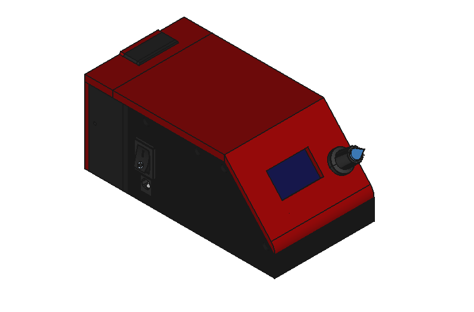

# Pullback-Device
This is an overview of a low-cost open source pullback device for varicose vein surgery.


## Usage
Look at the video attached bellow:
https://youtu.be/Uo2tgYB1XSM

## For Developers
1. Get the mechanical design at the folder "Mechanical" of this repository.
2. Get the schematic and PCB layout at the folder "Electrical" of this repository.
3. Get the source code by clonning this repository:
```
git clone https://github.com/syauqibilfaqih/Pullback-Device.git
```
Then, go to the folder "SourceCode". Make sure that you already have PlatformIO on your Visual Studio Code.

## Contact us
I realized that this readme still only contained short information right now. Should you have any question, don't hesitate to contact me at alisyauqibilfaqih@gmail.com
